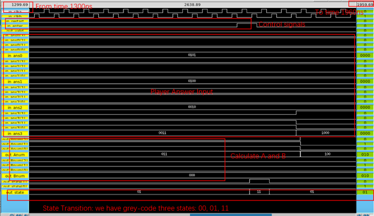

# 1A2B game (Bulls and Cows)
### Intro
The game '1A2B' is a classic code-breaking mind game in which a chip generates a unique 4-digit random number for the player to guess. After each guess, feedback is provided in the form of 'A's and 'B's: an 'A' indicates a correct digit in the correct position, while a 'B' signifies a correct digit in the wrong position. The player's goal is to deduce the secret number based on this feedback. The game continues with the player entering new guesses until they achieve '4A0B', indicating all digits are correctly guessed in their proper positions, at which point the player wins the game.

## Design flow
### FSM

*Figure 1: FSM design flow chart*

There are 3 states: IDLE, TEMPTEST and WAIT, we use grey code for the parameters for the states: 00, 01, 11. This module has several inputs including clka, clkb, loadtest, enter, and restart, along with conditions dp_same and dp_input_error that influence the machine's behavior. Outputs include same, input_error, save_test, reset, and the state itself.
The FSM operates with three primary states defined as constants: IDLE, TEMP_TEST, and WAIT. Transitions between these states are driven by the inputs. In the IDLE state, the machine will move to TEMP_TEST if loadtest is true; otherwise, it remains idle. In TEMP_TEST, it transitions to WAIT upon the enter signal. In WAIT, the machine checks if it should return to TEMP_TEST due to loadtest or revert to IDLE upon restart, otherwise it stays in WAIT.
The module uses two different clocks (clka and clkb) for sequential logic and output logic, respectively. Resetting, errors, and validation states are handled in specific cases within these clocked processes.
Below is the function of the FSM for the Game 1A2B:
When the signal loadtest is high, it controls the dp to load the random number from PRNG to the temp registers. At the TEMPTEST state, the system waits for the user to put the answer numbers. When the enter signal is high, it means that the user has already put the answer numbers, so it jumps to the next state WAIT, that means wait the dp to calculate the Anum and Bnum. If not 4A0B, the loadtest will be high again to jumb back to TEMPTEST and repeat another user input try. If 4A0B, the game over and wait for another restart to restart the game.

### The datapath

*Figure 2: DataPath design flow chart*

The dp (datapath) module in Verilog is designed to manage and validate a sequence of random numbers against user inputs, utilizing two clock signals (clka and clkb) for synchronization. 
The module operates by generating numbers with the connected prng instance and storing these in internal registers (num0 to num3). It uses a save_test control signal and a counting mechanism to selectively store non-repeating random numbers at different stages of the count. 
When a complete set of unique numbers is assembled, the module then compares these numbers against user-provided answers (ans0 to ans3). This comparison results in the calculation of Anum and Bnum scores, where Anum counts direct matches (correct numbers in the correct position), and Bnum counts indirect matches (correct numbers in the wrong position). Additionally, it checks for input errors (duplicate answers) and indicates whether all user inputs match the generated sequence exactly. This module effectively integrates number generation, storage, comparison, and validation into a cohesive verification system triggered by specific conditions and clock edges.
The integration of the system follows the common rules, connecting the wires and hiding the inner interface. The PRNG random number and the random number temp registers are the essential inner interfaces that will not be shown in the top module.
The Two phase clock clka and clkb are very important in our design. Clka controls the PRNG module. For the dp module, clka controls the load of random number temp registers from PRNG, and clkb controls the player input answer to the temp registers.

#### PRNG

*Figure 3: PRNG form*

The datapath instances a pseudo-random-number-generator (PRNG) using linear-feedback-shift-register (LFSR) method. Then by using a counter and switch case, we systolically load the generated random number to the temp registers (also ensure they are unique). A pseudo-random number generator (PRNG) using the linear-feedback-shift-register (LFSR) method leverages a shift register and linear feedback to generate a sequence of pseudo-random numbers. This approach involves shifting bits through the register while selectively applying feedback taps based on a polynomial to certain positions, effectively creating a long cycle of repeatable but seemingly random numbers. This method is favored for its simplicity and efficiency in hardware implementations. To ensure the complexity of the random numbers, we use the 8 bit temp random number. The Xilinx documentations have already calculated the feedback for each n bit of temp random numbers. So for n=8, feedback = random[7] ^ random[5] ^ random[4] ^ random[3]. Finally, we did a %10 to the random numbers to make it to the range of 0-9.

## Run the result
### Overview Guide
    a: Verilog pre-synthesis and post-synthesis Simulation
    b: progressing to Innovus images
    c: Magic layout
    d:Continue with Magic post-connection to pads
    e :Fulfilling Magic requirements for M1, M2, and poly layers,
    f: Concluding with pad connection and flattening and Simulation

1. In Questa folder

    vlib work -> vlog main_FSM.v dp.v top.v top_tb.v -> vsim top_tb (Questa would pop up)

2. In Questa

    Add -> To Wave -> Signals in Design -> run -all (see the waveform)

    
    *Figure 4: Questa pre-synthesis simulation*

3. In Synthesis folder

    run (generate .rep file, .svf file, .log file, and .vh file)

    cp *.vh ../Questa_post_DC

4. In Questa_post_DC folder

    vlib work -> vlog top.vh osu.v top_tb.v -> vsim top_tb (then repeat the part "In Questa")

    
    *Figure 5: Questa post-synthesis simulation*

5. In Innovus folder
    
    run -> win (Innovus window pop up)
    cp *.gds ../Irsim

    
    *Figure 6: Innovus layout*

6. In Irsim folder

    magic

7. In Magic

    calma rescale no -> open final.gds file -> select layout -> expand -> extract all -> ext2sim -t!

    
    *Figure 7: Magic layout from gds file(1 lambda = 0.3 micron)*

    According to the requirements and pin assignments, we have 30 pins in total, including 21 inputs and 9 outputs, connecting the core chip to GPIO functionalities. You can refer to the pin map in the sixth section for details. The following image shows the most basic connection of the Magic post-connection to pads that we've just completed

8. In Irsim folder

    irsim top.sim

9. In Irsim

    source test.cmd

    
    *Figure 8: Irsim simulation_1*

    
    *Figure 9: Irsim simulation_2*

    
    *Figure 10: Irsim simulation_3*

    
    *Figure 11: Irsim simulation_4*

10. Connect with 32-pin Padframe

    
    *Figure 12: Padframe connect with Magic layout*

11. Pin config & mapping

    
    *Figure 13: Pin configuration*

    
    *Figure 13: Pin mapping*

## Testing strategy to verify chip fabricaiton availability

Our project's establishment and validation strategy adhere to the concept of code partitioning. As outlined previously, our file structure is as follows: dp.v + main_FSM.v -> top.v. Initially, we thoroughly examined all states and transitions, constructed an FSM state machine, and drafted the dp.v file for data transmission. Individual validation was conducted to ensure the functionality of each Verilog file, including data generation comparison, result verification, and FSM transitions meeting requirements. Therefore, we separately authored dp_tb.v and fsm_tb.v files to initially validate the correctness of datapath and FSM respectively. Once validated individually, we proceeded to write the top file and its corresponding testbench.
Next, our testing methodology involved Questa-Synthesis-Questa Post flow. We verified pre and post-synthesis, ensuring no issues through log file checks. Subsequently, we proceeded to layout in Innovus. After verifying the log files without issues, we converted the obtained GDS file to a mag file. Utilizing our existing top_tb file, we crafted appropriate text cmd files for validation. Despite encountering bugs (specifically, issues surfaced only in Irsim despite Questa and Post Questa validation), extensive investigation revealed timing issues. We also devised HSPICE checks to ensure sufficient voltage.

Following this is the connection of pins to the padframe. Initially, we verified our total pin count, which amounted to 30, comprising 21 inputs and 9 outputs. After logically arranging and wiring, we connected the pins in the newly acquired PadFrame file, relabeling where necessary. Subsequently, we modified our previous text cmd file's label names for verification, yielding consistent results.

Our wiring diagram, depicting the overall layout, was previously displayed. Our file structure is as described above.
Verilog file: in Questa:use vlib work; vlog dp.v main_FSM.v top.v top_tb.v vsim top_tb 

Synthesis file: In Synthesis, see compile_dc.tcl, use run
Post Synthesis validation: In Questa_post_DC, use vlib work; vlog osu05_stdcells.v top.vh top_tb.v vsim top_tb 
Innovus file: In Innovus, use run
Irsim file: In Innovus, copy gds file from Innovus, then load gds, extract and ext2sim, then irsim
Hspice file: In Hspice, copy spice after ext2spice, and then hspice test.exp
Padframe file: in padframe, first step into pad_06_frame, open PadFrame.mag file to get the connected file, and the step into flat_pad file to get the flatted mag file.
Final GDS and clf file: In Finalchip file. 
